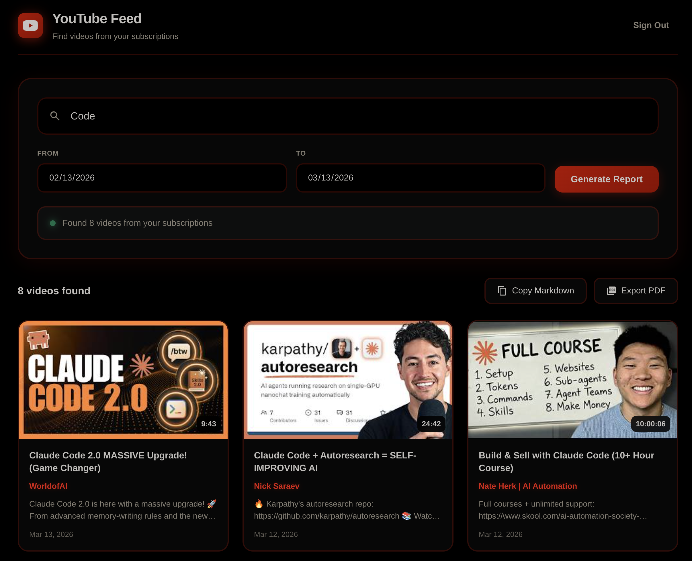

# YouTube Feed

A modern web application that helps you find videos from your YouTube subscription channels on any topic. Generate beautiful reports with video details and export them as Markdown or PDF.




## Features

- 🔐 **Google OAuth Authentication** - Secure sign-in with your Google account
- 📺 **Subscription Discovery** - Fetches all your YouTube subscription channels
- 🔍 **Topic Search** - Search for videos on specific topics from your subscriptions
- 📅 **Date Filtering** - Filter videos by date range
- 📋 **Markdown Export** - Copy results as a formatted Markdown table
- 📄 **PDF Export** - Download a professional PDF report
- 🎨 **Modern UI** - Dark theme with YouTube-inspired red accents
- 📱 **Responsive** - Works on desktop and mobile devices

## Demo

1. Open the app in your browser
2. Sign in with your Google account
3. Enter a topic (e.g., "Python", "AI", "Cooking")
4. Set date range (optional)
5. Click "Generate Report"
6. Export as Markdown or PDF

## Prerequisites

- Node.js 18+ 
- A Google Cloud project with YouTube Data API v3 enabled
- OAuth 2.0 credentials (Client ID)

## Setup

### 1. Clone the Repository

```bash
git clone <repository-url>
cd yt-report
```

### 2. Install Dependencies

```bash
npm install
```

### 3. Configure Google OAuth

1. Go to [Google Cloud Console](https://console.cloud.google.com/)
2. Create a new project or select an existing one
3. Enable **YouTube Data API v3**
4. Go to **APIs & Services** → **Credentials**
5. Create **OAuth 2.0 Client ID** (Web application)
6. Add the following to **Authorized JavaScript origins**:
   - `http://localhost:8080`
7. Add the following to **Authorized redirect URIs**:
   - `http://localhost:8080`
8. Copy your **Client ID**

### 4. Configure Environment Variables

Create a `.env` file in the root directory:

```env
VITE_YOUTUBE_CLIENT_ID=your-client-id-here.apps.googleusercontent.com
```

### 5. Run the Application

```bash
npm run dev
```

The app will be available at `http://localhost:8080`

### 6. Production Build

```bash
npm run build
```

The built files will be in the `dist` folder.

## Project Structure

```
yt-report/
├── src/
│   ├── components/
│   │   ├── Header.jsx        # App header with logo
│   │   ├── SearchPanel.jsx   # Search input and date filters
│   │   ├── VideoGrid.jsx     # Video results grid
│   │   ├── VideoCard.jsx     # Individual video card
│   │   └── ExportButtons.jsx # Export buttons
│   ├── App.jsx               # Main application component
│   ├── App.css               # All styles
│   ├── main.jsx              # React entry point
│   └── index.css             # Base CSS reset
├── .env                      # Environment variables (not committed)
├── .gitignore                # Git ignore rules
├── index.html                # HTML entry point
├── package.json              # Dependencies
├── vite.config.js            # Vite configuration
└── README.md                 # This file
```

## Tech Stack

- **React 19** - UI framework
- **Vite** - Build tool and dev server
- **@react-oauth/google** - Google OAuth authentication
- **html2pdf.js** - PDF generation
- **YouTube Data API v3** - YouTube data access

## API Endpoints Used

| Endpoint | Purpose |
|----------|---------|
| `subscriptions/list` | Fetch user's subscription channels |
| `search/list` | Search for videos by topic |
| `videos/list` | Get video details (duration, etc.) |

## Environment Variables

| Variable | Description |
|----------|-------------|
| `VITE_YOUTUBE_CLIENT_ID` | Your Google OAuth Client ID |

## Security Notes

- The app uses OAuth 2.0 token-based authentication
- Access tokens are stored in sessionStorage (cleared on tab close)
- No sensitive data is stored on the server
- Your Client ID should be kept confidential

## Troubleshooting

### "redirect_uri_mismatch" Error
Make sure your OAuth redirect URI matches exactly in Google Cloud Console:
- `http://localhost:8080` (no trailing slash)

### "access_denied" Error
Add your email as a test user in Google Cloud Console:
- Go to **OAuth consent screen** → **Test users**
- Add your Google email address

### Blank Screen After Login
- Check browser console for errors
- Ensure JavaScript origins are configured correctly

## License

MIT License - feel free to use this project for learning or personal projects.

## Acknowledgments

- [YouTube Data API v3](https://developers.google.com/youtube/v3)
- [Google Identity Services](https://developers.google.com/identity)
- [React](https://react.dev)
- [Vite](https://vitejs.dev)
